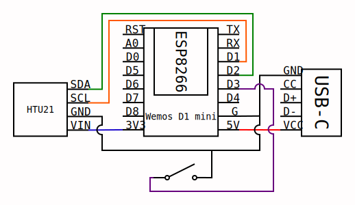
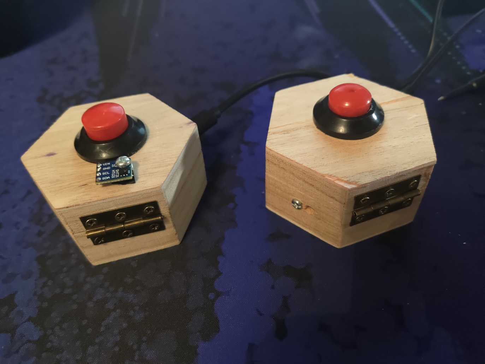
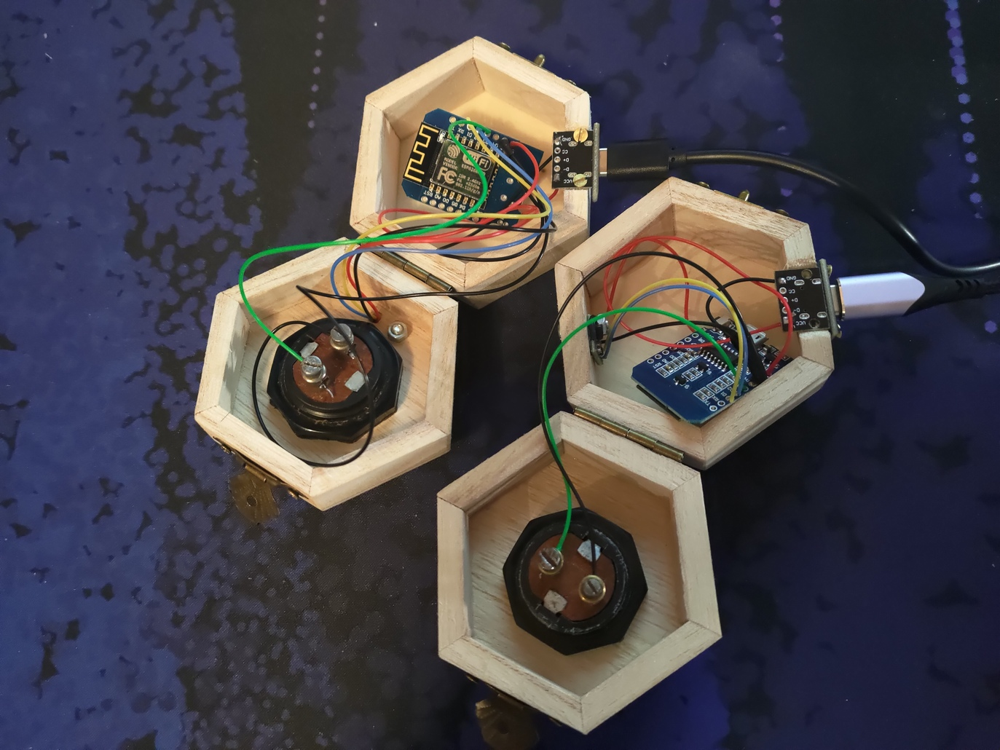
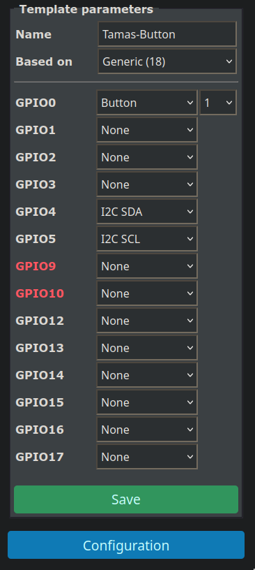
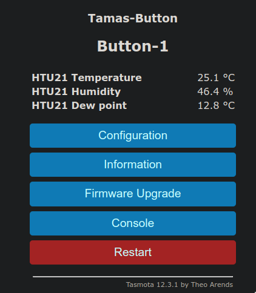
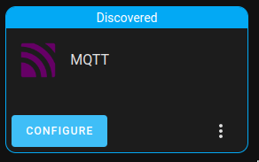
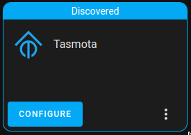

# WiFi-s nyomógomb és hőmérő

## Áttekintés
Ez egy WiFi-képes okos eszköz, amely Home Assistant rendszerbe integrálható, hogy eseményeket és adatokat továbbítson, amelyekkel egyéb eszközöket vezérelhetünk vagy naplózhatjuk őket.

### Események
|Kiváltó ok                            |Hatás                                          |
|--------------------------------------|-----------------------------------------------|
|Gomb egyszeri rövid megnyomása        |Home Assistant "button_short_press" trigger    |
|Gomb kétszeri rövid megnyomása        |Home Assistant "button_double_press" trigger   |
|Gomb háromszori rövid megnyomása      |Home Assistant "button_triple_press" trigger   |
|Gomb négyszeri rövid megnyomása       |Home Assistant "button_quadruple_press" trigger|
|Gomb ötszöri rövid megnyomása         |Home Assistant "button_quintuple_press" trigger|
|Gomb hatszori rövid megnyomása        |Wi-Fi beállítások alaphelyzetbe állítása       |
|Gomb egyszeri hosszú megnyomása       |Home Assistant "button_long_press" trigger     |
|Gomb egyszeri nagyon hosszú megnyomása|Minden beállítás alaphelyzetbe állítása        |

[Bővebb angol leírás](https://tasmota.github.io/docs/Buttons-and-Switches/#multi-press-functions)

Az alaphelyzetbe állítás után az eszköz egy saját Wi-Fi hálózatot kezd sugározni `tasmota-******-****` mintájú néven, amelyre telefonnal vagy számítógéppel rácsatlakozhatunk. A csatlakozás után a http://192.168.4.1 címen konfigurálhatjuk az eszközt, hogy a saját hálózatunkra kapcsolódjon.

## Alkatrészek
- Wemos D1 mini, vagy hasonló Tasmota-kompatibilis mikrokontroller
- HTU21, vagy hasonló I2C hőmérséklet érzékelő
- Nyomógomb
- USB-C kifejtő panel (opcionális)
    - A szabványos USB-C kábelen két CC vezeték van, ezeket külön-külön 5.1 kΩ-os ellenállással kell a földre kötni. A panel, amit én használtam összeköti ezt a két vezetéket, így olyan kábellel nem lehet táplálni, aminek mindkét vége USB-C. Érdemes vagy jobb panelt választani, vagy közvetlenül a mikrokontroller tápellátását használni.

## Kapcsolási rajz


## Lehetséges összeépítés



## Tasmota telepítés

Részletesebb angol nyelvű leírás [itt](https://tasmota.github.io/docs/Getting-Started/).

1. Csatlakoztassuk a mikrokontrollert a rajta lévő mikro-USB porton keresztül (nem a dobozon lévő USB-C porton keresztül) egy számítógéphez.
2. Nyissuk meg a [webes tasmota telepítő](https://tasmota.github.io/install/) weboldalt egy Chromium alapú böngészőben (pl. Google Chrome).
3. Válasszuk ki a `Tasmota Sensors` verziót
    - Sok I2C-n keresztül kapcsolódó érzékelő csak ebben a verzióban támogatott, beleértve a használt HTU21-et is.
4. Kattintsunk a `CONNECT` gombra
5. Válasszuk ki a programozandó eszközt
    - A kiválasztást segíti, ha megnyomjuk a `CONNECT` gombot úgy, hogy az eszköz nincs bedugva, majd úgy, hogy be van dugva. Ekkor az újonnan megjelent portot lehet kiválasztani.
6. Kattintsunk az `INSTALL TASMOTA SENSORS` gombra
    1. Opcionálisan jelöljük be az "Erase device" checkboxot. Ez az eszköz teljes memóriáját ki fogja törölni
    2. Kattintsunk a `NEXT` gombra
    3. Erősítsük meg a telepítést az `INSTALL` gombbal
    4. Türelem tornaterem
    6. Amikor megjelenik, hogy `Installation complete`, kattintsunk a `NEXT` gombra
7. Ha nem lép magától a `Configure Wi-Fi` stádiumba a program, kattintsunk a `CHANGE WI-FI` gombra. Egy legördülő menüben láthatjuk az elérhető Wi-Fi hálózatokat. Válasszuk ki közülük a sajátunkat, és adjuk meg a jelszavát. Az eszköz ezt meg fogja jegyezni és áramtalanítás után is erre a hálózatra fog kapcsolódni.
8. Kattintsunk a `VISIT DEVICE` gombra
    - Ezen a ponton érdemes megjegyezni az IP címet, ami a böngésző címsorában megjelenik (pl. 192.168.0.54) például egy könyvjelző beállításával
    - A későbbiekben valószínűleg ezen az IP címen lesz elérhető az eszköz konfigurációs oldala

## Konfiguráció

1. Nyissuk meg egy webböngészőben az eszköz konfigurációs oldalát
    - Jó esetben az előző szekcióból megvan az IP cím, amin ez elérhető
    - Ha nem tudjuk a címet, esetleg megváltozott, akkor például a [Fing](https://play.google.com/store/apps/details?id=com.overlook.android.fing) alkalmazás képes listázni a telefon hálózatára csatlakozott eszközöket. Egy lehetőség, hogy áramtalanítjuk az eszközt és keressük a listában az elérhetetlenné vált eszközt.
2. Állítsuk be a lábak kiosztását
    1. `Configuration`
    2. `Configure Other`
    3. A következő szöveget illesszük be a `Template` mezőbe:
    ```
    {"NAME":"Tamas-Button","GPIO":[32,0,0,0,640,608,0,0,0,0,0,0,0,0],"FLAG":0,"BASE":18}
    ```
    > Ugyanezt az eredményt érjük el, ha a `Configure Template` opciót választjuk, és a képnek megfelelően kitöltjük.
    >
    > 
    4. Jelöljük be az `Activate` checkboxot
    5. Adjunk valamilyen egyedi nevet az eszköznek
        - A `Device name` és a `Friendly Name` nyugodtan megegyezhet, azt hiszem akár szóköz is lehet bennük, de biztosabb kerülni a különleges karaktereket
    6. Az Emulate opcióra nem lesz szükségünk, hagyjuk a `None`-t kiválasztva
    7. Kattintsunk a `Save` gombra
    8. Várjuk meg amíg az eszköz újraindul
    9. A főoldalon `Temperature`,  `Humidity` és `Dew point` értékek jelennek meg
    > 
3. Állítsuk be az egyéb opciókat
    1. Válasszuk a `Console` menüpontot
    2. Írjuk be az alábbi [parancsot](https://tasmota.github.io/docs/Commands/#setoption73), amellyel függetleníthetjük a gomb működését a (nem létező) relétől
    ```
    SetOption73 1
    ```
    3. Az [események](#események) között a rövid, hosszú és nagyon hosszú nyomvatartás közti idő [konfigurálható](https://tasmota.github.io/docs/Commands/#setoption32). Tizedmásodpercekben kell megadni, hogy mennyi ideig kelljen nyomva tartani a gombot, hogy hosszú nyomvatartásként érzékelje. A nagyon hosszú nyomvatartás mindig ennek tízszerese. Az alábbi parancs 1 másodpercre állítja a hosszú nyomvatartási időt:
    ```
    SetOption32 10
    ```
    4. A hőmérséklet érzékelő sajnos nem nagyon pontos. Fixen hozzáadhatunk vagy elvehetünk a jelentett értékből, ha pontatlanságot észlelünk a [TempOffset](https://tasmota.github.io/docs/Commands/#tempoffset) parancssal. A következő példa 1,5 °C-kal csökkenti a jelentett értéket:
    ```
    TempOffset -1.5
    ```

## Home Assistant integráció

### MQTT bróker telepítése a Home Assistantra
1. Nyissuk meg a Home Assistant weboldalát
2. Navigáljunk a `Settings`/`Add-ons` menübe
3. A jobb alul található `Add-on Store`-ban keressük meg a `Mosquitto broker` nevű modult.
4. Az `INSTALL` gombbal telepítsük
5. A telepítés végeztével kapcsoljuk be a `Start on boot`, `Watchdog` opciókat, esetleg az `Auto update` opciót is
6. Ezen a ponton a Home Assistant IP címével, 1883-as porton elérhető egy MQTT bróker, amelyhez a home assistant felhasználónevével és jelszavával lehet csatlakozni
7. A Home Assistant `Settings`/`Devices & Services` menüjében az `Integrations` fülön meg kellett jelennie az `MQTT` integration-nek a képen látható módon
>
8. Kattintsunk a `CONFIGURE` gombra, és az alapértelmezett beállításokat válasszuk

### MQTT beállítása a Tasmota eszközön
1. Nyissuk meg a konfigurálandó eszköz weboldalát egy böngészőben
2. `Configuration`
3. `Configure MQTT`
4. A `Host` legyen az az IP cím, ahol a brókerünk fut (amin keresztül a Home Assistant weboldalát is elérjük)
5. A `Port` legyen 1883
6. A `Client` mezőt nem kell megváltoztatnunk, de ha mégis megváltoztatnánk, akkor az értéke legyen egyedi, az alapértelmezett `DVES_%06X` érték a hardveres azonosítóból generálódik
6. A `User` és `Password` legyen az a felhasználónév és jelszó, amivel a Home Assistanthoz is hozzáférünk
7. A `Topic` mezőt nem kell megváltoztatnunk, de ha mégis megváltoztatnánk, akkor az értéke legyen egyedi, az alapértelmezett `tasmota_%06X` érték a hardveres azonosítóból generálódik
8. A `Full Topic` mezőt nem kell megváltoztatnunk, de ha mégis megváltoztatnánk, akkor az értéke legyen egyedi, az alapértelmezett `%prefix%/%topic%/` felhasználja a beállított `Topic` nevet
9. Ha sikerült a csatlakozás, akkor a Home Assistant `Settings`/`Devices & Services` menüjében az `Integrations` fülön meg kellett jelennie a Tasmota integrációnak a képen látható módon
> 
10. Kattintsunk a `CONFIGURE` gombra, és az alapértelmezett beállításokat válasszuk
11. A `Devices` fülön ezután megjelenik a felkonfigurált Tasmota eszköz

### Home Assistant autmatizáció beállítása
1. Nyissuk meg a Home Assistant weboldalát
2. Navigáljunk a `Settings`/`Automations & Scenes` menü `Automations` fülére
3. Kattintsunk jobb alul a `CREATE AUTOMATION` gombra
4. Válasszuk a `Start with an empty automation` opciót
5. Kattintsunk az `ADD TRIGGER` gombra és válasszuk a `Device` opciót
6. A `Device` listában meg kell jelennie a korábban beállított eszköznek, válasszuk ki azt
7. A `Trigger` listában meg kell jelennie az összes eseménynek, amit az eszköz képes kiváltani, válasszuk ki, amelyikre szeretnénk valamilyen akciót kiváltani
8. Az `ADD ACTION` gombbal adjuk hozzá azokat az akciókat, amiket szeretnénk ha kiváltana az esemény